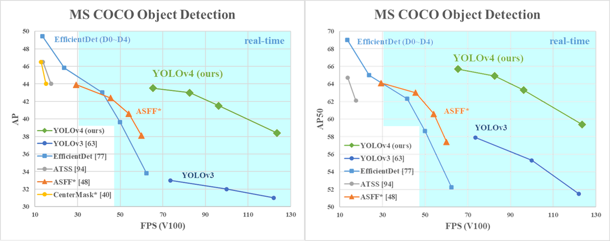
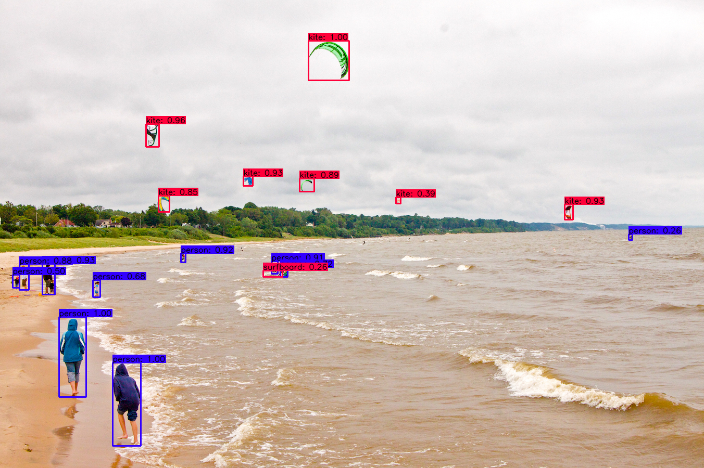
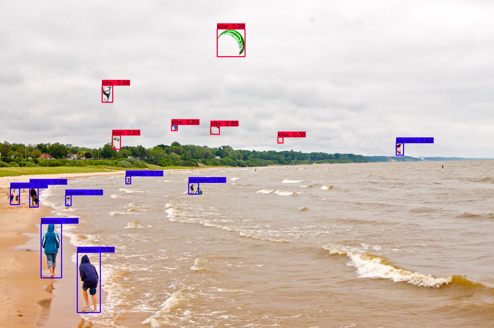

# **UPDATE**
1. For cusotm models fix the `config.py` file with own `obj.names` where there is `coco.names`. Issue fix, https://github.com/hunglc007/tensorflow-yolov4-tflite/issues/147#issuecomment-666736983. In this repo I have replaced `coco.names` with `obj.names`. It should contain custom class names.
2. Set `private static boolean isTiny = true;` instead of `false` to make android code work for default model with repo.
3. Commented out `#converter.representative_dataset = representative_data_gen` in `convert_tflite.py` since I don't have coco dataset. Reference, https://github.com/hunglc007/tensorflow-yolov4-tflite/issues/214.
4. For converting yolov4 tiny model to tflite use `--framework tflite` flag in `save_model.py`. Reference, https://github.com/hunglc007/tensorflow-yolov4-tflite/issues/234#issuecomment-704097171.
5. For some reason the provided coco model and some custom models detect objects correctly, but bounding box is shown on top left corner. Setting `isGPU = false` in `YoloV4Classifier.java` increases inference time, but allows bounding boxes to be drawn correctly. One of my custom yolov4 tiny model worked with GPU, but no longer works. :dart:

### **Custom Model Deployment**
Train `custom model` with, https://github.com/AlexeyAB/darknet and deploy with android example. Set `isTiny = false` for full yolov4, `TF_OD_API_IS_QUANTIZED = true` for `int8` quantized model and appropriate model path, class name.

### Deploy Yolov4 Tiny to Android
An issue with unsupported ops `EXP`, `SPLIT`, `SPLIT_V` is shown when deploying to android. It is solved by using `implementation 'org.tensorflow:tensorflow-lite-select-tf-ops:0.0.0-nightly'` on android `build.gradle` and below code to convert tensorflow `saved model`. It is unquantized FP32 model.

Tiny weights to saved model,

```
## yolov4-tiny
!python save_model.py \
--weights "yolov4-tiny-obj_best.weights" \
--output "checkpoints/yolov4-tiny-416" \
--input_size 320 --model yolov4 --tiny --framework tflite
```

Saved model to tflite,

```
import tensorflow as tf
converter = tf.lite.TFLiteConverter.from_saved_model(saved_model_dir)
converter.optimizations = [tf.lite.Optimize.DEFAULT]

converter.target_spec.supported_ops = [tf.lite.OpsSet.SELECT_TF_OPS]
#converter.target_spec.supported_types = [tf.float16]
#converter.target_spec.supported_ops = [tf.lite.OpsSet.EXPERIMENTAL_TFLITE_BUILTINS_ACTIVATIONS_INT16_WEIGHTS_INT8]

tflite_quant_model = converter.convert()

tflite_path = '/content/model.tflite'
with open(tflite_path, 'wb') as f:
  f.write(tflite_quant_model)
 ```

### Add Custom Classes From Java Code

Classes can also be read from `*.txt` file by providing path. It can also be added in `YoloV4Classifier.java` by adding lines like below and commenting out code below.

```
d.labels.add("car");
d.labels.add("bike");

//        String actualFilename = labelFilename.split("file:///android_asset/")[1];
//        InputStream labelsInput = assetManager.open(actualFilename);
//        BufferedReader br = new BufferedReader(new InputStreamReader(labelsInput));
//        String line;
//        while ((line = br.readLine()) != null) {
//            LOGGER.w(line);
//            d.labels.add(line);
//        }
//        br.close();
```


### Issue with given model

The given models detections show on the top left corner for some reason. I remember fixing it, but can no longer find the fix. Yet my custom trained tflite model on 320x320 with FP16 quantization works correctly. Also the provided model with the repo is yolo tiny. 

For custom model deployment `OUTPUT_WIDTH_TINY` or `OUTPUT_WIDTH_FULL` needs to be filled with proper value. The value can be easily found on the error log. Yolov4 full not tested yet.

```
java.lang.IllegalArgumentException: Cannot copy from a TensorFlowLite tensor (Identity) with shape [1, 1500, 4] to a Java object with shape [1, 2535, 4].
```

For example, if current width values are `{2535, 2535}` then just change it to `{1500, 1500}`. 

In `YoloV4Classifier.java` change `INPUT_SIZE` to appropriate size. For example if network height width is 320 then input size is 320. Also change `TF_OD_API_INPUT_SIZE` to appropriate resolution value in `MainActivity.java` for single image and `DetectorActivity.java` for realtime processing.

Set `TF_OD_API_IS_QUANTIZED` to true if the custom model is FP16 quantized.


### Issue with dynamic graph

This is an error from converted tflite model. I fixed it previously, but no longer working. One probable(need to check) reason is the model was trained in a different resolution say for example 608x608 in training `*.cfg`, but when converting to saved model it was asked to use `416` or `320`. 


An important note, https://github.com/hunglc007/tensorflow-yolov4-tflite/issues/128.

<hr>

# tensorflow-yolov4-tflite
[](LICENSE)


### This repo is based on: https://github.com/hunglc007/tensorflow-yolov4-tflite

YOLOv4, YOLOv4-tiny Implemented in Tensorflow 2.0. 
Convert YOLO v4, YOLOv3, YOLO tiny .weights to .pb, .tflite and trt format for tensorflow, tensorflow lite, tensorRT.

Download yolov4.weights file: https://drive.google.com/open?id=1cewMfusmPjYWbrnuJRuKhPMwRe_b9PaT


### Prerequisites
* Tensorflow 2.3.0 on build.gradle and using same version to convert model. Colab can be used.

### Performance
<p align="center"></p>

### Demo

```bash
# Convert darknet weights to tensorflow
## yolov4
python save_model.py --weights ./data/yolov4.weights --output ./checkpoints/yolov4-416 --input_size 416 --model yolov4 

## yolov4-tiny
python save_model.py --weights ./data/yolov4-tiny.weights --output ./checkpoints/yolov4-tiny-416 --input_size 416 --model yolov4 --tiny

# Run demo tensorflow
python detect.py --weights ./checkpoints/yolov4-416 --size 416 --model yolov4 --image ./data/kite.jpg

python detect.py --weights ./checkpoints/yolov4-tiny-416 --size 416 --model yolov4 --image ./data/kite.jpg --tiny

```
If you want to run yolov3 or yolov3-tiny change ``--model yolov3`` in command

#### Output

##### Yolov4 original weight
<p align="center"></p>

##### Yolov4 tflite int8
<p align="center"></p>

### Convert to tflite

```bash
# Save tf model for tflite converting
python save_model.py --weights ./data/yolov4.weights --output ./checkpoints/yolov4-416 --input_size 416 --model yolov4 --framework tflite

# yolov4
python convert_tflite.py --weights ./checkpoints/yolov4-416 --output ./checkpoints/yolov4-416.tflite

# yolov4 quantize float16
python convert_tflite.py --weights ./checkpoints/yolov4-416 --output ./checkpoints/yolov4-416-fp16.tflite --quantize_mode float16

# yolov4 quantize int8
python convert_tflite.py --weights ./checkpoints/yolov4-416 --output ./checkpoints/yolov4-416-int8.tflite --quantize_mode int8 --dataset ./coco_dataset/coco/val207.txt

# Run demo tflite model
python detect.py --weights ./checkpoints/yolov4-416.tflite --size 416 --model yolov4 --image ./data/kite.jpg --framework tflite
```

Yolov4 and Yolov4-tiny int8 quantization have some issues. I will try to fix that. You can try Yolov3 and Yolov3-tiny int8 quantization 

### Convert to TensorRT
```bash# yolov3
python save_model.py --weights ./data/yolov3.weights --output ./checkpoints/yolov3.tf --input_size 416 --model yolov3
python convert_trt.py --weights ./checkpoints/yolov3.tf --quantize_mode float16 --output ./checkpoints/yolov3-trt-fp16-416

# yolov3-tiny
python save_model.py --weights ./data/yolov3-tiny.weights --output ./checkpoints/yolov3-tiny.tf --input_size 416 --tiny
python convert_trt.py --weights ./checkpoints/yolov3-tiny.tf --quantize_mode float16 --output ./checkpoints/yolov3-tiny-trt-fp16-416

# yolov4
python save_model.py --weights ./data/yolov4.weights --output ./checkpoints/yolov4.tf --input_size 416 --model yolov4
python convert_trt.py --weights ./checkpoints/yolov4.tf --quantize_mode float16 --output ./checkpoints/yolov4-trt-fp16-416
```


### Benchmark
```bash
python benchmarks.py --size 416 --model yolov4 --weights ./data/yolov4.weights
```
#### TensorRT performance
 
| YoloV4 416 images/s |   FP32   |   FP16   |   INT8   |
|---------------------|----------|----------|----------|
| Batch size 1        | 55       | 116      |          |
| Batch size 8        | 70       | 152      |          |

#### Tesla P100

| Detection   | 512x512 | 416x416 | 320x320 |
|-------------|---------|---------|---------|
| YoloV3 FPS  | 40.6    | 49.4    | 61.3    |
| YoloV4 FPS  | 33.4    | 41.7    | 50.0    |

#### Tesla K80

| Detection   | 512x512 | 416x416 | 320x320 |
|-------------|---------|---------|---------|
| YoloV3 FPS  | 10.8    | 12.9    | 17.6    |
| YoloV4 FPS  | 9.6     | 11.7    | 16.0    |

#### Tesla T4

| Detection   | 512x512 | 416x416 | 320x320 |
|-------------|---------|---------|---------|
| YoloV3 FPS  | 27.6    | 32.3    | 45.1    |
| YoloV4 FPS  | 24.0    | 30.3    | 40.1    |


### Traning your own model

Training can be done with [Darknet](https://github.com/AlexeyAB/darknet) using custom dataset. Both yolov4 full and tiny version is supported. Process for going from darknet weights to android is, darknet weight -> saved model -> tflite/quantied tflite.


### References

  * YOLOv4: Optimal Speed and Accuracy of Object Detection [YOLOv4](https://arxiv.org/abs/2004.10934).
  * [darknet](https://github.com/AlexeyAB/darknet)
  
   This project is inspired by these previous fantastic YOLOv3 implementations:
  * [Yolov3 tensorflow](https://github.com/YunYang1994/tensorflow-yolov3)
  * [Yolov3 tf2](https://github.com/zzh8829/yolov3-tf2)

   This repo is based on:
  * https://github.com/hunglc007/tensorflow-yolov4-tflite
